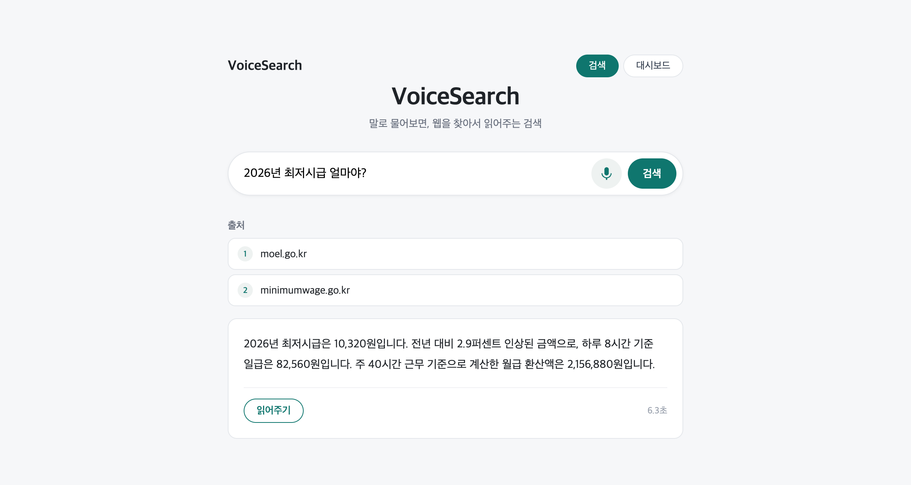
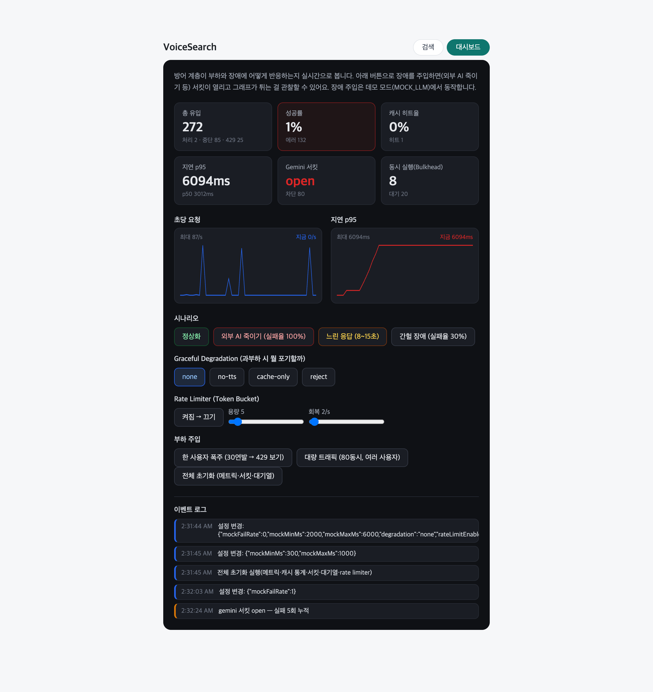

[한국어](README.md) | **日本語** | [English](README.en.md)

# VoiceSearch

**ライブデモ**: https://voicesearch-cwh9.onrender.com (Renderの無料ティアなので初回リクエストは遅いことがある)

マイクに向かって質問すると、ウェブを検索して根拠付きで回答し、その回答を音声で
読み上げる検索サービス。React、Express(TypeScript)、Gemini APIで作った。
検索はExa APIまたはGemini内蔵のGoogle検索、音声合成はElevenLabsまたは
ブラウザ内蔵音声を使用。



## なぜ作ったのか

LLMは学習時点以降の出来事を知らない。以前、ドキュメントアップロード型のRAG
チャットボット(DocChat)を作りながら「根拠を与え、根拠の中だけで答えさせる」構造を
練習したが、今回はその根拠をアップロードされた文書ではなく、リアルタイムの
ウェブ検索から取得するように変えてみた。さらに入力は音声認識、出力は音声合成を
組み合わせ、画面を見続けなくても使える検索を目指した。

## 動作の仕組み

```
マイクボタン → ブラウザのWeb Speech APIが発話をテキストに変換(中間結果をリアルタイム表示)
  → 発話が終わると自動的に POST /api/search
  → EXA_API_KEY がある場合
      Exaでウェブ検索5件 → 出典リストを先に送信
      → 検索結果をプロンプトに入れて生成 → SSEでトークン単位ストリーミング
  → ない場合
      Gemini内蔵のGoogle検索(grounding)で検索と生成を一度に実行
      → 回答をストリーミング → 参照したページを出典として送信

読み上げボタン → POST /api/voice → ElevenLabsがmp3を生成 → 再生
  → キーがない、または失敗した場合はブラウザ内蔵音声(speechSynthesis)にフォールバック
```

## こだわった部分

### 音声で読み上げる回答は、プロンプトから違う

回答は画面にも表示されるが、最終的には声で読み上げられる。そのためプロンプトで
マークダウン書式を禁止し、声に出して読んだとき自然な文章になるよう要求した。
実際に「2.9%」の代わりに「2.9パーセント」のように読み下した回答が返る。
出典番号 [1] は画面には必要だが朗読すると不自然なので、TTSに送る前にサーバー側で
取り除く。

### キーがなければ、あるもので動くように

外部キーが用意できていないせいでデモが止まるのが嫌だったので、有料・外部APIごとに
代替経路を用意した。検索はExaキーがなければGemini内蔵のGoogle検索に、
音声合成はElevenLabsが失敗したら(キーなし・上限超過とも)ブラウザ内蔵の
speechSynthesisで代替する。そのため GEMINI_API_KEY 一つだけで全機能が動く。
どちらの音声で再生中かは画面に表示し、ElevenLabs無料プラン(月1万クレジット)を
節約するため、TTSに送るテキストも600文字で切り詰める。

### 出典を回答より先に送る

Exa経路では検索が終わると出典5件(タイトル、ドメイン、日付)を先に送信し、
その後に生成を始める。生成を待つ間にも「何を根拠に答えるのか」が先に見えるので、
体感の待ち時間が短い。回答の文末には [1]、[2] でどの出典を使ったかを示し、
出典同士で内容が食い違う場合はより新しい日付を優先させる。内蔵検索経路は検索と
生成が1回の呼び出しなので順序が逆になるが(回答ストリーミング後に出典が到着)、
フロントはイベントタイプだけを見て描画するため、両方の順序を処理できる。

### LLMプロバイダーの差し替え

GeminiとOpenAIを .env の LLM_PROVIDER の値一つで切り替え可能。両SDKの
ストリーミングAPIの形が違うので、どちらも「テキスト片を吐き出すasync generator」に
包んで統一した。ルート側のコードはどのプロバイダーが繋がっているか知らない。
429、5xxのような一時的エラーは指数バックオフで再試行し、キーが間違っている401のような
エラーは再試行せず、すぐユーザーに原因を伝える。

### 話し終えたら即検索

音声認識の中間結果(interim)を受け取り続けて入力欄にリアルタイム表示し、ブラウザが
発話終了と判断したら確定テキストで即座に検索を実行する。ボタンをもう一度押す
必要はない。Web Speech APIはChrome系にしかないため、未対応ブラウザでは
マイクボタンを隠してテキスト検索だけを残す。

### 過負荷と障害に耐える4層防御

遅くて不安定な外部AIをラップするサーバーなので、「多く処理すること」より「外部が
揺れても耐えること」が核心だと考えた。Rate Limiter(Token Bucket自作) → Circuit
Breaker → Bulkhead(APIごとのセマフォ) → Graceful Degradation の4層に、キャッシュ・
再試行・タイムアウトを追加。各決定の代替案比較と負荷テスト実測(キャッシュで
p50 3905→1ms、障害時にサーキットが壁時計時間を半減など)は
[docs/RESILIENCE.ja.md](docs/RESILIENCE.ja.md) にまとめた。ダッシュボードで
障害を注入しながら、防御が発動する様子をリアルタイムで観察できる。注入した設定は
最終操作の10分後に自動で正常化される(訪問者が仕掛けたまま去ってもデモが
汚染されたまま残らないように)。



## 技術スタック

- フロント: React (Vite, TypeScript)
- バックエンド: Node.js + Express (TypeScript)
- ウェブ検索: Gemini内蔵Google検索(デフォルト)または Exa API
- LLM: Gemini API `gemini-3.6-flash`(デフォルト)または OpenAI、無料ティアで動作
- 音声入力: Web Speech API (ブラウザ内蔵)
- 音声出力: ElevenLabs TTS + speechSynthesisフォールバック
- ロギング: pino (構造化JSONログ)
- 負荷テスト: 自作スクリプト + k6

## 実行方法

1. サーバー

```bash
cd server
cp .env.example .env   # GEMINI_API_KEYだけで動作 (Exa、ElevenLabsは任意)
npm install
npm run dev            # http://localhost:3001
```

2. フロント

```bash
cd web
npm install
npm run dev            # http://localhost:5173
```

Chromeで開いてマイクボタンを押し、「2026年の最低賃金はいくら?」のように
質問してみるとよい。ELEVENLABS_API_KEYはなくても動作する(ブラウザ音声に
フォールバック)。

3. テスト (レジリエンスユーティリティ26個 — 4層組み合わせのguardテストを含む)

```bash
cd server && npm test
```

4. 負荷テスト / ダッシュボードデモ (外部LLMなしでサーバー層だけを測定)

```bash
# デモサーバー: 外部LLMを「遅くて時々失敗する」mockに隔離
cd server && MOCK_LLM=1 MOCK_LLM_MIN_MS=300 MOCK_LLM_MAX_MS=1000 npm start
# 別ターミナルで負荷 (同時50、合計200)
npx tsx loadtest/run.mts 50 200
# フロントを起動し、ダッシュボードタブで障害/負荷を注入しながら観察
```

## プロジェクト構成

```
server/
  src/
    server.ts        Expressアプリ、Rate Limiter(検索・音声)、メトリクス/注入エンドポイント(ADMIN_TOKEN保護)
    exa.ts           Exaウェブ検索 (exaGuardでラップ)
    llm.ts           Gemini/OpenAIストリーミング生成、内蔵検索(grounding)経路
    guards.ts        外部APIごとの保護膜(サーキット+再試行+セマフォ+タイムアウト)設定
    runtimeConfig.ts ランタイム障害注入設定 (ダッシュボードが調整)
    mockLlm.ts       負荷テスト用の偽LLM (遅延と確率的失敗)
    logger.ts        pino構造化ロギング
    metrics.ts       インメモリメトリクス (p50/p95/p99、カウンター)
    sse.ts           SSEパースの純粋関数 (+テスト)
    resilience/
      timeout.ts, semaphore.ts, cache.ts, circuitBreaker.ts,
      rateLimiter.ts, guard.ts   (各 .test.ts 付き)
    routes/
      search.ts      Rate Limit → キャッシュ → 経路選択 → SSE、ロギング/メトリクス/デグラデーション
      voice.ts       ElevenLabs TTSプロキシ (デグラデーション時は断念)
web/
  src/
    api.ts           fetch + SSEパース、メトリクス/注入/負荷発射
    App.tsx          音声認識、検索画面、再生とフォールバック、タブ切替
    Dashboard.tsx    リアルタイムメトリクスグラフ + 障害/負荷注入コントロール
loadtest/
  run.mts            自作負荷スクリプト (SSEをdoneまで読んでシナリオ集計)
  k6-throughput.js   k6: 段階的な負荷増加、429の安全な拒否を検証
  k6-ratelimit.js    k6: 一人のユーザーの暴走 → Rate Limiterの遮断率
docs/
  RESILIENCE.md      4層防御のPAR (問題-代替案比較-実装-実測)
  PORTFOLIO.md       アーキテクチャと技術選定の概要
  *.ja.md / *.en.md  上記ドキュメントの日本語・英語版 (README を含む)
```

## 限界と次にやりたいこと

- 音声認識がWeb Speech API依存のためChrome系でしか動かない。WhisperのようなSTT
  APIに替えればブラウザを選ばないが、録音をサーバーに上げる構造が必要なので
  次の課題として残した。
- 単発の質問のみ対応。前の質問を覚えるマルチターンはなし。
- 音声再生が回答生成の完了後に始まる。ElevenLabsのストリーミングAPIで文単位に
  先行生成すれば、最初の音が出るまでの待ちを減らせそう。
- 内蔵検索経路は出典リンクがGoogleのリダイレクトURLで届き、検索結果の件数や
  本文抜粋を制御できず、回答内の [1] インライン番号も付けられない。
  細かい制御が必要ならExa経路を使えばよい。
- デプロイはRenderの無料ティアで公開済み(Expressがリアクトのビルド結果も一緒に配信)。
